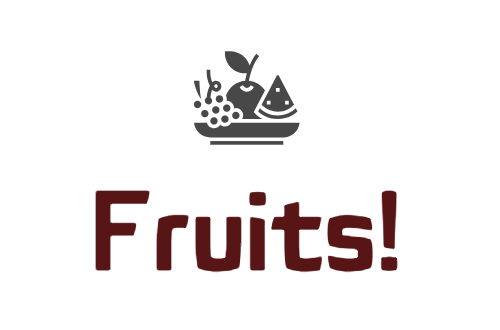

# Projet8-Openclassrooms Déployer d'un modèle dans le cloud (AWS) 
## Deploy a Model on AWS

&nbsp;

**Author:** Gulsum Kapanoglu

***

## Description de projet!
La très jeune start-up de l'AgriTech, nommée "Fruits!", cherche à proposer des solutions innovantes pour la récolte des fruits. Elle souhaite dans un premier temps se faire connaître en mettant à disposition du grand public une application mobile qui permettrait aux utilisateurs de prendre en photo un fruit et d'obtenir des informations sur ce fruit.

La volonté de l’entreprise est de préserver la biodiversité des fruits en permettant des traitements spécifiques pour chaque espèce de fruits en développant des robots cueilleurs intelligents. 

Pour la start-up, cette application permettrait de sensibiliser le grand public à la biodiversité des fruits et de mettre en place une première version du moteur de classification des images de fruits. De plus, le développement de l’application mobile permettra de construire une première version de l'architecture Big Data nécessaire.

Développer une première architecture Big Data,
Préprocessing des images et réduction de dimension,
Anticipation du passage à l’échelle.

## Objectif de projets
L'objectif de ce projet est de développer un environnement Big Data qui comprendra le preprocessing et une étape de réduction de dimension.
Tenir compte du fait que le volume de données va augmenter très rapidement après la livraison de ce projet, ce qui implique de:
Déployer le traitement des données dans un environnement Big Data,
Développer les scripts en pyspark pour effectuer du calcul distribué,
Utiliser le cloud AWS pour profiter d’une architecture Big Data (EMR, S3, IAM)

## Data
Le jeu de données est un ensemble d'images de fruits et de labels associés: https://www.kaggle.com/moltean/fruits!

## Méthodes
Technologies que j'ai utilisées dans ce projet; développer des scripts en Pyspark et à utiliser le cloud AWS pour profiter d’une architecture Big Data (EMR, S3, IAM).
Une étape de réduction de dimension de type PCA en PySpark 

Ce travail a été réalisé lors du projet 8 de ma formation Centrale Supèlec et OpenClassrooms de Data Scientist durant le mois de Janvier 2023. Il utilise des images disponibles sur Kaggle.
